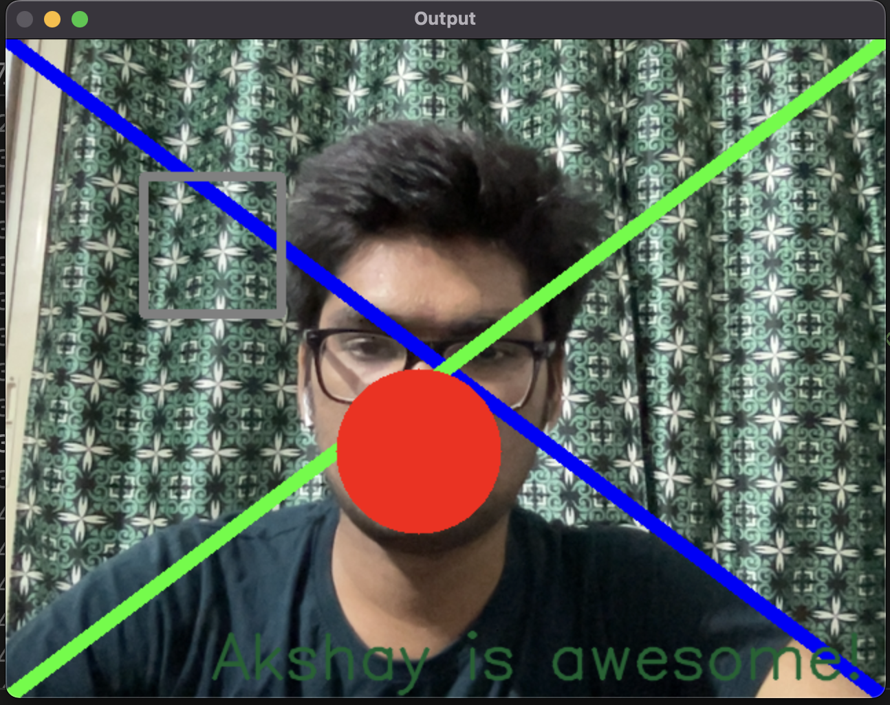

### Line
cv2.line(frame, coordinate of one end, coordinate of other end, BGR color tuple, thickness)

### Rectangle
cv2.rectangle(frame, top left coordinate, bottom right coordinate, BGR value, thickness)
- put thickness = -1 to fill

### Circle
cv2.circle(frame, center coordinate, radius, BGR colour tuple, thickness)

### Text
font = cv2.FONT\<fonts>
cv2.putText(source, text string, bottom left coordinate, font, font scale, colour, thickness, line type)

