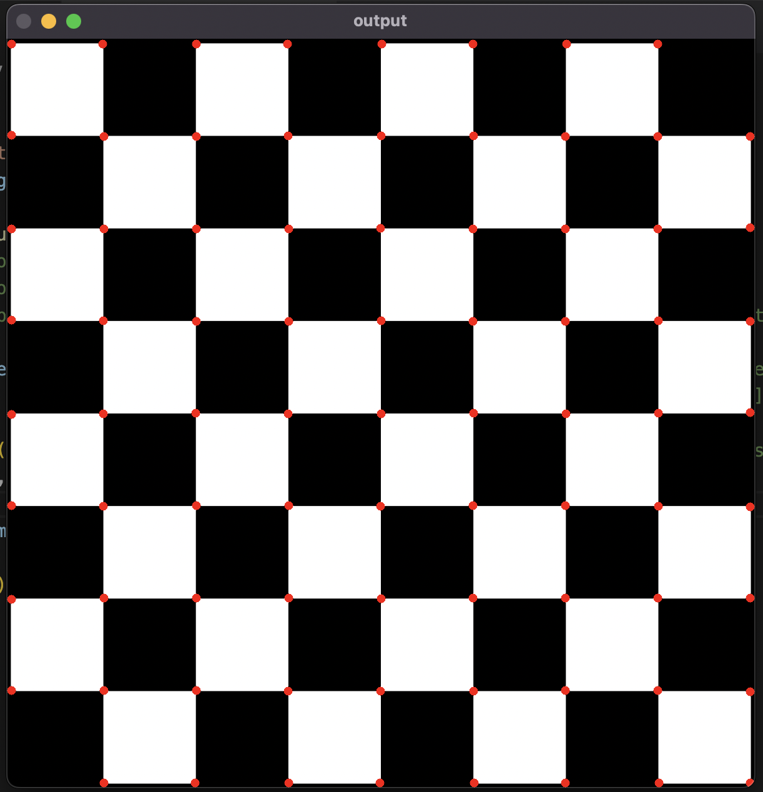
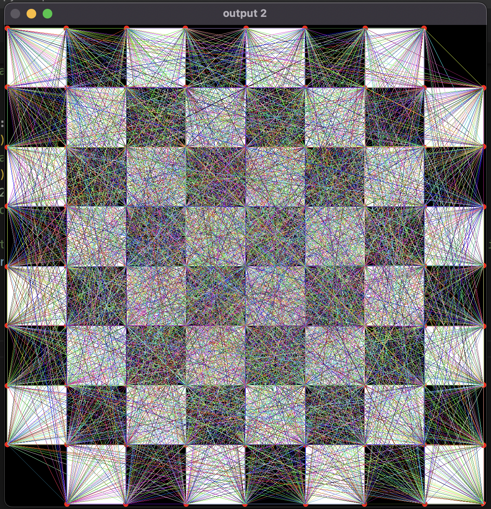

```
void cv::goodFeaturesToTrack(InputArray 	image,*                                                     
                            OutputArray 	corners,                                                     
                            int 	maxCorners,*                                                      
                            double 	qualityLevel,*                                                     
                            double 	minDistance,*                                                      
                            InputArray 	mask = noArray(),                                                      
                            int 	blockSize = 3,                                                      
                            bool 	useHarrisDetector = false,                                                      
                            double 	k = 0.04                                                      
                            )	
```	
\* Only this parameters are used in the code demonstration

Algorithm behind this corners dection is [Shi-Tomasi Corner Detector & Good Features to Track](https://docs.opencv.org/3.4/d4/d8c/tutorial_py_shi_tomasi.html)


### Input


<br/>

### Main output


<br/>

### Joing every two corners
